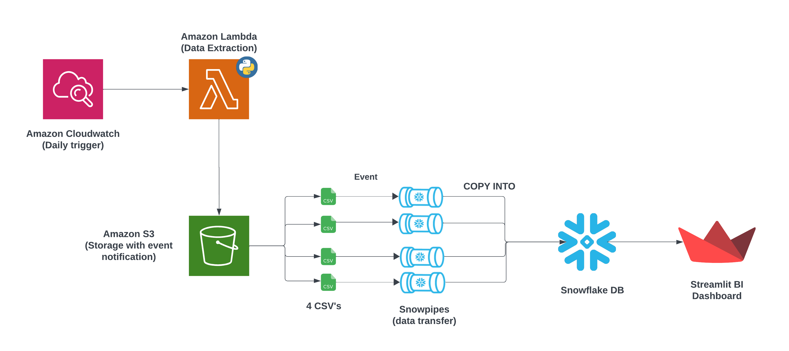
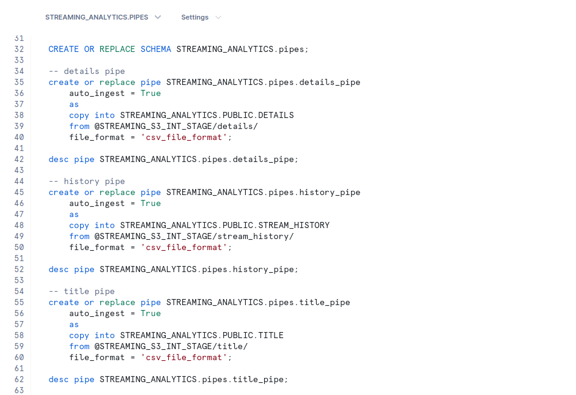

# Streaming Service Analytics Dashboard

An interactive dashboard for analyzing content trends across various streaming services. The project showcases a modern data pipeline using AWS services, Snowflake, and Streamlit.

-Web App: [Streaming Service Analytics](https://stream-analytics.streamlit.app/)

## 🏗️ Architecture

1. **Data Source**: Daily updates are pushed to an Amazon S3 bucket.
2. **AWS Lambda**: Triggered by S3 events via CloudWatch, processes the new data.
3. **Snowpipe**: Automatically loads processed data from S3 into Snowflake tables.
4. **Snowflake**: Stores and manages the data, allowing for fast querying.
5. **Streamlit**: Fetches data from Snowflake to render interactive charts and filters.

## 🌟 Features

- 📊 Interactive charts for TV ratings, IMDB scores, release years, runtimes, and genres.
- 📈 Cumulative content growth visualization by streaming service.
- 🔍 Filters for content type (movies/TV shows) and streaming services.
- 🔄 Daily data updates ensure the latest insights.
